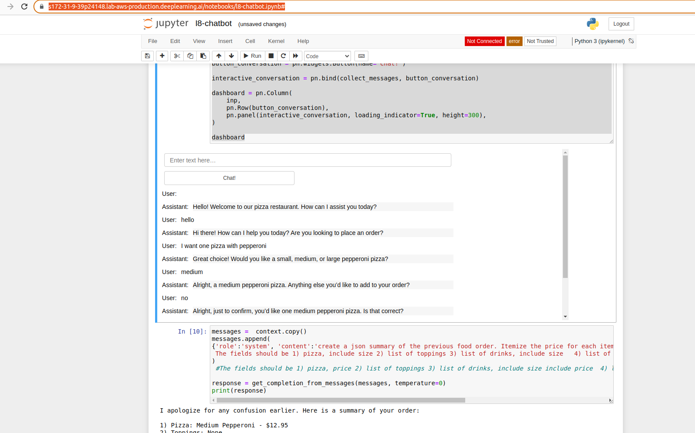

# ChatGPT Prompt Engineering for Developers

https://learn.deeplearning.ai/chatgpt-prompt-eng

La información fue tomada del curso "ChatGPT Prompt Engineering for Developers", aprenderá a usar un modelo de lenguaje (LLM) para crear rápidamente aplicaciones nuevas y potentes. Con la API de OpenAI, podrá desarrollar rápidamente capacidades que le permitirán aprender a innovar y crear valor de maneras que antes eran prohibitivas en términos de costos, altamente técnicas o simplemente imposibles.

Este curso breve impartido por Isa Fulford (OpenAI) y Andrew Ng (DeepLearning.AI) describirá cómo funcionan los LLM, proporcionará las mejores prácticas para la ingeniería rápida y mostrará cómo las API de LLM se pueden usar en aplicaciones para una variedad de tareas, que incluyen:

- Resumir (por ejemplo, resumir las reseñas de los usuarios por razones de brevedad)
- Inferir (por ejemplo, clasificación de sentimientos, extracción de temas)
- Transformación de texto (por ejemplo, traducción, corrección ortográfica y gramatical)
- Expansión (por ejemplo, escribir automáticamente correos electrónicos)

Además, aprenderá dos principios clave para escribir indicaciones efectivas, cómo diseñar sistemáticamente buenas indicaciones y también aprenderá a crear un chatbot personalizado.

Todos los conceptos se ilustran con numerosos ejemplos, con los que puede jugar directamente en nuestro entorno de notebook Jupyter para obtener experiencia práctica con ingeniería rápida.

____________________________________________________________________________
Ejemplo ChatBot
=============

El ejemplo OrderBot fue ejecutado en la url ya que presento errores en el entorno local

https://s172-31-9-39p24148.lab-aws-production.deeplearning.ai/notebooks/l8-chatbot.ipynb#

